<div align="center">



<br/>

**배운 것을 서비스로 만들고, 만든 것으로 다시 배우는 백엔드 개발자**

<a href="https://movingon.kr"></a>
<a href="mailto:sin005090@gmail.com"></a>


<sub>
<a href="#-whoami">whoami</a> ·
<a href="#-tech-stack">Tech Stack</a> ·
<a href="#-featured-project">Project</a> ·
<a href="#-study">Study</a> ·
<a href="#-activity">Activity</a>
</sub>

</div>

---

## 💻 whoami

한국폴리텍대학 서울강서캠퍼스 **빅데이터소프트웨어공학과**에서 백엔드 개발을 공부하고 있습니다.<br/>
팀 프로젝트 **MoveOn**에서 화면부터 서버, 외부 API 연동까지 **실제로 동작하는 서비스**를 만들었습니다.

```yaml
profile:
  name: 신의진
  role: Backend Developer
  school: 한국폴리텍대학 서울강서캠퍼스 · 빅데이터소프트웨어공학과
  focus: [Java, Spring Boot, MyBatis, MariaDB]
  learning: [Spring AI]
  motto: "Learn → Build → Ship"
```

<br/>

## 🛠 Tech Stack

<div align="center">


<br/><br/>


<br/>


</div>

<br/>

## 🚀 Featured Project

<div align="center">
<table>
<tr>
<td>

<h3 align="center">🏃 <a href="https://github.com/MoveOn-Team/MoveOn">MoveOn</a></h3>
<p align="center"><b>나에게 맞는 운동을 추천해 주는 웹 서비스</b></p>

<p align="center">
<a href="https://movingon.kr"></a>


</p>

사용자의 **성향 · 날씨 · 위치**를 바탕으로 운동과 주변 체육시설, 스포츠 행사를 추천합니다.

| 🙋 담당 역할 | |
|:--|:--|
| 🧭 **온보딩** | 첫 로그인 후 성향조사 기능 구현 |
| 🖥️ **화면 개발** | 내 정보 · 즉시운동 · 스포츠 행사 · 홈 트레이닝 |
| 📊 **백엔드** | 운동 완료 · 운동 리포트 |
| 🌤️ **API 연동** | OpenWeather API 날씨 기능 |
| 🎬 **UX 개선** | 운동 동작 이미지를 MP4 영상으로 교체 |

</td>
</tr>
</table>
</div>

<br/>

## 📚 Study

| | Repository | 내용 |
|:--:|:--|:--|
| 🌱 | [SpringBootMyBatis](https://github.com/sin005090/SpringBootMyBatis) | Spring Boot + MyBatis 실습 |
| 🤖 | [StringAIBasic](https://github.com/sin005090/StringAIBasic) | Spring AI 기초 실습 |
| ☕ | [myJava](https://github.com/sin005090/myJava) | Java 기초 문법 실습 |

<br/>

## 📈 Activity

<div align="center">


</div>

<br/>

---

<div align="center">

<sub>⌨️ <b>Learn → Build → Ship</b> · Thanks for visiting!</sub>

</div>
